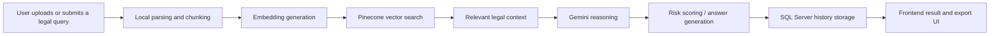

# LegAI HUB Ecosystem
legal-ai-assistant-manh301.vercel.app

[](https://developer.mozilla.org/en-US/docs/Web/JavaScript)
[](https://react.dev/)
[](https://nodejs.org/)
[](https://www.microsoft.com/sql-server)
[](https://www.pinecone.io/)
[](https://ai.google.dev/)

A Vietnamese legal assistant platform for contract analysis, legal document retrieval, and digital media compliance review.

The system combines RAG, semantic search, embeddings, and LLM-driven reasoning to crawl legal sources, chunk and index documents, retrieve relevant context from Pinecone, and generate practical legal responses.

## Project Overview

LegAI HUB is designed as a production-oriented legal AI ecosystem with a local-first processing strategy and a cloud-assisted fallback path. It is optimized for legal document workflows, contract risk review, historical record storage, and multimedia compliance checks.

The project follows a single-language JavaScript stack across the main application layers:

- Frontend: React, Tailwind CSS, Recharts, Heroicons
- Backend: Node.js, Express
- Database: Microsoft SQL Server
- AI Core: Gemini API and Pinecone vector database

## Core Features

### 1. AI document generation

Automatically generates legal and commercial document templates based on structured user input such as full name, citizen ID, tax ID, bank account number, and address. The UI is designed to adapt smoothly to variable content height and form-driven input.

The document generation interface lives in [Frontend](Frontend).

### 2. Contract analysis and risk review

The contract analysis module parses clauses, classifies legal risk, and computes a safety score using a deterministic scoring workflow with strict capping rules.

- Dangerous: -40 points
- High Risk: -20 points
- Advisory: -10 points

Analysis results and history rendering are handled in [Frontend/src/components/AnalysisDetailView.jsx](Frontend/src/components/AnalysisDetailView.jsx).

### 3. Video content compliance analysis

The video analysis module processes text-based streams, extracts subtitles, audio signals, and contextual cues to flag content that may violate Vietnamese media regulations or public administrative policies.

The UI component is located at [Frontend/src/components/VideoAnalysisDetailView.jsx](Frontend/src/components/VideoAnalysisDetailView.jsx).

### 4. Internal legal lookup and RAG

Pinecone stores embedded legal document chunks for fast retrieval and semantic matching. This enables the system to cross-check legal context before producing responses.

- API routing and RAG entry point: [AI_Engine/src/routes/apiRoutes.js](AI_Engine/src/routes/apiRoutes.js)
- Gemini integration and two-stage processing: [AI_Engine/src/services/geminiService.js](AI_Engine/src/services/geminiService.js)

### 5. Historical record management

The system persists analysis history to SQL Server, exposes the original filename in a clean UI, keeps the layout minimal, and supports administrative PDF export.

## Architecture and RAG Workflow

LegAI HUB uses a two-phase routing model to keep the system responsive and resilient:

1. Local-first processing
   - The router disables broad internet search when possible.
   - Large documents are processed locally first to reduce bandwidth pressure and avoid rate-limit issues.
   - The system isolates short, unresolved statements for lightweight cloud queries.

2. Search grounding and fallback
   - When internal RAG coverage is incomplete, the system can crawl authoritative Vietnamese legal sources such as vbpl.vn and thuvienphapluat.vn.
   - If search grounding is throttled or returns 503/429 errors, the router falls back to internal LLM knowledge to preserve availability.

3. Scheduler and cleanup
   - Scheduled jobs monitor crawling and ingestion tasks.
   - Temporary files are removed after processing to free server resources.

### High-level flow



## Tech Stack

| Layer | Technology |
| --- | --- |
| Frontend | React, Tailwind CSS, Recharts, Heroicons, Framer Motion |
| Backend | Node.js, Express, Socket.IO |
| AI / LLM | Gemini API |
| Vector Search | Pinecone |
| Database | Microsoft SQL Server |
| Document Processing | `mammoth`, `pdf-parse`, `puppeteer`, `youtube-transcript` |

## Installation and Setup

### Prerequisites

- Node.js 18+ recommended
- Microsoft SQL Server
- Pinecone account and API key
- Gemini API key
- Git

### 1. Clone the repository

```bash
git clone <your-repo-url>
cd GR114
```

### 2. Configure the AI backend

The Node.js AI microservice is located in [AI_Engine](AI_Engine).

```bash
cd AI_Engine
npm install
npm run dev
```

### 3. Configure the frontend

The frontend is a Vite application located in [Frontend](Frontend).

```bash
cd Frontend
npm install
npm run dev
```

### 4. Optional Laravel backend

The repository also includes a Laravel application in [Backend](Backend). If you use it as the main application backend, keep its endpoints aligned with the Node.js AI microservice or run both side by side:

- Node.js for AI microservices and RAG
- Laravel for the core business application

## Environment Variables

Create a `.env` file in `AI_Engine` and configure the following values:

```env
PORT=8000
DB_USER=sa
DB_PASSWORD=your_sql_server_password
DB_SERVER=localhost
DB_DATABASE=your_database_name
GEMINI_API_KEY=your_gemini_api_key
PINECONE_API_KEY=your_pinecone_api_key
PINECONE_ENV=your_pinecone_environment
```

Recommended additional environment settings may be required depending on your SQL Server authentication mode, deployment target, or internal API gateway configuration.

## Database Setup

The application expects a `Records` table with the following columns:

- `Id`
- `Title`
- `FileName`
- `ContractText`
- `AnalysisJson`
- `RiskScore`

If you are using SQL Server locally, make sure the database user has read/write access to the target database and any ingestion or export workflows.

## Usage

1. Open the frontend and submit a contract, legal question, or media content for analysis.
2. The backend processes the content locally first, then performs retrieval against Pinecone if legal context is needed.
3. Gemini generates the final response using the retrieved context and the system’s internal rules.
4. Results are stored in SQL Server and rendered in the history/detail views.

Typical user-facing workflows include:

- Drafting structured legal templates from form input
- Reviewing contract clauses and risk levels
- Checking video or media content for compliance concerns
- Searching internal legal knowledge through RAG
- Exporting analysis history for administrative use

## API Flow

The main technical entry points are:

- REST and graph-style routing: [AI_Engine/src/routes/apiRoutes.js](AI_Engine/src/routes/apiRoutes.js)
- Gemini orchestration and fallback logic: [AI_Engine/src/services/geminiService.js](AI_Engine/src/services/geminiService.js)
- Contract analysis UI and history rendering: [Frontend/src/components/AnalysisDetailView.jsx](Frontend/src/components/AnalysisDetailView.jsx)
- Video compliance UI: [Frontend/src/components/VideoAnalysisDetailView.jsx](Frontend/src/components/VideoAnalysisDetailView.jsx)

Typical API sequence:

1. Client submits text, file, or media metadata.
2. Backend normalizes and chunks the input.
3. Embeddings are generated and queried against Pinecone.
4. The most relevant legal context is assembled.
5. Gemini produces the final analysis or answer.
6. The result is stored in SQL Server and returned to the UI.

## Folder Structure

```text
GR114/
├── AI_Engine/          # Node.js AI microservice and RAG logic
├── Backend/            # Laravel backend
├── Frontend/           # React + Vite frontend
├── README.md
└── ...
```

Key files:

- [AI_Engine/src/routes/apiRoutes.js](AI_Engine/src/routes/apiRoutes.js)
- [AI_Engine/src/services/geminiService.js](AI_Engine/src/services/geminiService.js)
- [Frontend/src/components/AnalysisDetailView.jsx](Frontend/src/components/AnalysisDetailView.jsx)
- [Frontend/src/components/VideoAnalysisDetailView.jsx](Frontend/src/components/VideoAnalysisDetailView.jsx)

## Security Notes

- Never commit API keys directly into source code.
- Store secrets in environment variables or a secret manager.
- Restrict internal ingestion and indexing endpoints with an internal API key or IP allowlist.

## Future Improvements

- Add automatic background jobs for document ingestion and RAG rebuilding.
- Expand incremental embedding updates when legal sources change.
- Introduce a queue system such as Bull or Agenda for heavy parsing and external grounding tasks.
- Add stronger observability for crawl status, rate limits, and fallback behavior.
- Improve export and audit features for enterprise and compliance use cases.

## Deployment and Operations

- Run the AI microservice separately when you need scalable document processing or large RAG rebuilds.
- Store embeddings in Pinecone and refresh them incrementally as legal data changes.
- Use a two-step job pipeline: local parsing first, Gemini and external grounding second.
- Clean up temporary artifacts after each processing run to keep the server stable.

## Contributing

Contributions are welcome. If you plan to submit changes, please keep the architecture consistent and preserve the local-first RAG workflow.

Suggested contribution flow:

1. Fork the repository.
2. Create a feature branch.
3. Make your changes with clear, minimal commits.
4. Test the affected frontend or backend area.
5. Open a pull request with a concise description of the change.

## Quick References

- [AI_Engine/src/routes/apiRoutes.js](AI_Engine/src/routes/apiRoutes.js)
- [AI_Engine/src/services/geminiService.js](AI_Engine/src/services/geminiService.js)
- [Frontend/src/components/AnalysisDetailView.jsx](Frontend/src/components/AnalysisDetailView.jsx)
- [Frontend/src/components/VideoAnalysisDetailView.jsx](Frontend/src/components/VideoAnalysisDetailView.jsx)
